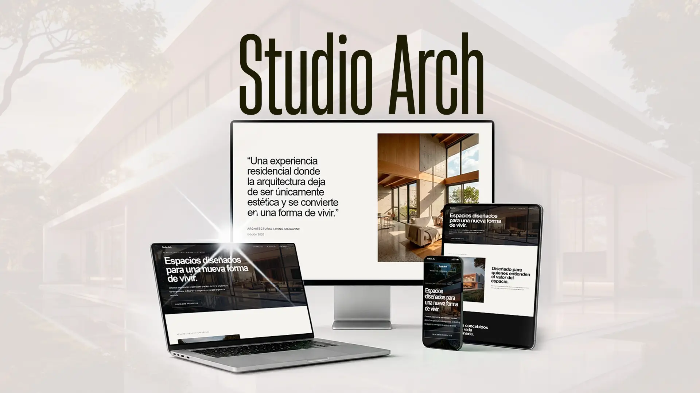
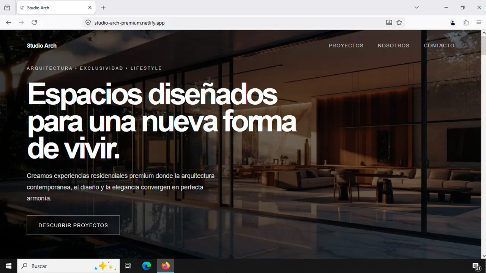
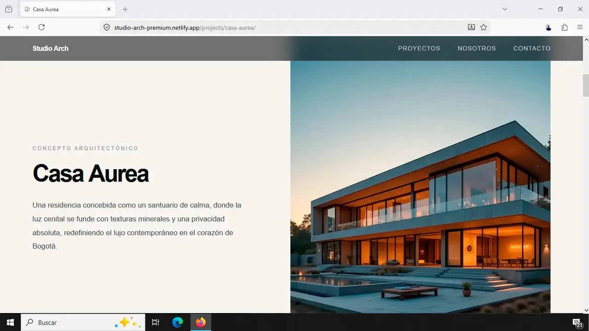
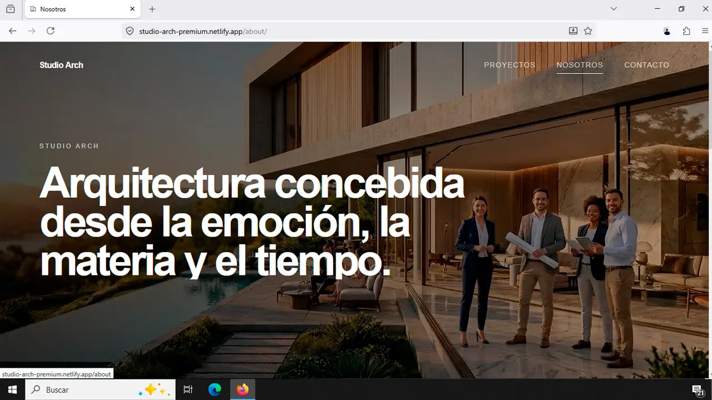
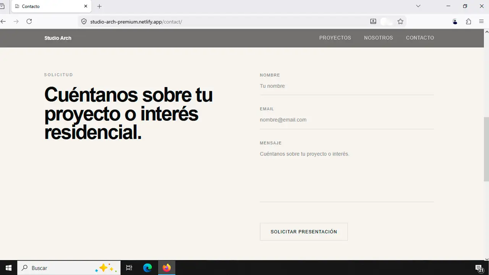

# Studio Arch Premium | Portfolio de Arquitectura Contemporánea

Web site premium para un estudio de arquitectura contemporánea, con animaciones cinéticas y experiencia visual inmersiva para atraer clientes de proyectos residenciales de lujo.

---

## Acceso en Vivo

[▶️ studio-arch-premium.netlify.app](https://studio-arch-premium.netlify.app/)

---

## Experiencia Visual

### Vista General - Responsivo



---

### Secciones Destacadas

| Sección Hero                                                               | Galería de Proyectos                                                          |
| -------------------------------------------------------------------------- | ----------------------------------------------------------------------------- |
|  |  |

| Sección Nosotros                                                           | Sección Contacto                                                               |
| -------------------------------------------------------------------------- | ------------------------------------------------------------------------------ |
|  |  |

---

## Experiencia Cinética en Acción

<p align="center">
  <video src="./public/readme-media/vid-studio.mp4" autoplay loop muted playsinline width="100%"></video>
</p>

---

## Descripción

Studio Arch Premium es una solución digital diseñada para un estudio de arquitectura contemporánea que requería una presencia web que reflejara la precisión técnica y el rigor estético de sus proyectos residenciales de lujo.

El sitio fue construido con un énfasis en la experiencia del usuario: cada movimiento de scroll, cada transición, cada interacción visual comunica deliberadamente la filosofía del estudio. La navegación es fluida, las animaciones son precisas, y el rendimiento es excepcional incluso con complejas capas de JavaScript.

**Objetivo:** Impresionar a arquitectos, inversores y compradores potenciales mediante una experiencia digital que eleva el estudio como referente en diseño residencial contemporáneo.

---

## Características Técnicas

- Animaciones GSAP avanzadas con ScrollTrigger sincronizado
- Scroll suave mediante Lenis, sin sacrificar control de rendimiento
- Lazy loading inteligente para galería de proyectos
- Tipografía jerárquica diseñada para narrativa visual
- SEO técnico optimizado con schema.json para arquitectura
- Rendimiento de 98+ en PageSpeed Insights con stack complejo de animaciones
- Diseño responsive adaptado a velocidades de scroll variables en mobile

---

## Stack Tecnológico

### Framework & Core

<p>
  
  
  
</p>

### Estilos & UI

<p>
  
  
  
</p>

### Librerías de Animación

<p>
  
  
</p>

### Herramientas & Deploy

<p>
  
  
</p>

---

## Métricas de Rendimiento

### PageSpeed Insights

**Desktop**

- Rendimiento: 98/100
- Accesibilidad: 100/100
- SEO: 100/100
- Mejores Prácticas: 100/100

**Mobile**

- Rendimiento: 94/100
- Accesibilidad: 100/100
- SEO: 100/100
- Mejores Prácticas: 100/100

### Core Web Vitals

| Métrica                        | Valor   | Estado          |
| ------------------------------ | ------- | --------------- |
| LCP (Largest Contentful Paint) | < 1.5s  | Óptimo          |
| FCP (First Contentful Paint)   | < 0.8s  | Óptimo          |
| CLS (Cumulative Layout Shift)  | < 0.05  | Excelente       |
| TBT (Total Blocking Time)      | < 200ms | 60fps sostenido |

### Nota sobre Optimización

Alcanzar PageSpeed 98+ con GSAP + Lenis es un logro técnico significativo. Sitios típicos con animaciones complejas rondan 80-90. Esta puntuación demuestra optimización avanzada en:

- Carga lazy de GSAP (solo módulos utilizados)
- Inicialización de Lenis sin memory leaks
- Deshabilitación de animaciones en dispositivos con preferencia de movimiento reducido
- Compresión de imágenes con WebP y srcset
- Eliminación de CSS no utilizado

---

## Estructura del Proyecto

```
studio-arch-premium/
├───public
│   │   favicon.svg
│   │   og-cover.webp
│   │   robots.txt
│   │
│   └───readme-media
│           capture1.webp
│           capture2.webp
│           capture3.webp
│           capture4.webp
│           mockup.webp
│           vid-studio.mp4
│
└───src
    ├───animations
    │       gsap.ts
    │       lenis.ts
    │       reveal.ts
    │
    ├───assets
    │   └───images
    │       ├───about
    │       │       about-desktop.webp
    │       │       about-mobile.webp
    │       │
    │       ├───gallery
    │       │       gallery1.webp
    │       │       gallery2.webp
    │       │       gallery3.webp
    │       │
    │       ├───hero
    │       │       hero-desktop.webp
    │       │       hero-mobile.webp
    │       │
    │       └───projects
    │           ├───casa-aurea
    │           │       gallery-1.webp
    │           │       gallery-2.webp
    │           │       gallery-3.webp
    │           │       hero-desktop.webp
    │           │       hero-mobile.webp
    │           │       story.webp
    │           │
    │           ├───lumen-residences
    │           │       gallery-1.webp
    │           │       gallery-2.webp
    │           │       gallery-3.webp
    │           │       hero-desktop.webp
    │           │       hero-mobile.webp
    │           │       story.webp
    │           │
    │           └───vista-norte
    │                   gallery-1.webp
    │                   gallery-2.webp
    │                   gallery-3.webp
    │                   hero-desktop.webp
    │                   hero-mobile.webp
    │                   story.webp
    │
    ├───components
    │       Footer.astro
    │       Header.astro
    │
    ├───data
    │       projects.ts
    │
    ├───layouts
    │       BaseLayout.astro
    │
    ├───pages
    │   │   about.astro
    │   │   contact.astro
    │   │   index.astro
    │   │   projects.astro
    │   │
    │   ├───api
    │   │       contact.ts
    │   │
    │   └───projects
    │           [slug].astro
    │
    ├───scripts
    │       contact-form.ts
    │       main.ts
    │
    ├───sections
    │   │   AmenitiesSection.astro
    │   │   CtaSection.astro
    │   │   HeroSection.astro
    │   │   ImmersionSection.astro
    │   │   ProjectSection.astro
    │   │   TestimonialSection.astro
    │   │
    │   └───contact
    │           ContactForm.astro
    │
    └───styles
        │   global.css
        │
        └───components
                about.css
                amenitiessection.css
                contact.css
                contactform.css
                ctasection.css
                footer.css
                header.css
                herosection.css
                immersionsection.css
                projects.css
                projectsection.css
                slug.css
                testimonialsection.css
├── astro.config.mjs
├── tailwind.config.mjs
├── tsconfig.json
└── package.json
```

---

## Decisiones Técnicas Justificadas

### Astro 6 en lugar de Next.js

**Decisión:** Astro con renderizado estático (SSG)

**Justificación:**

- El contenido del portafolio no cambia en tiempo real
- Astro genera HTML estático = 0 JavaScript innecesario en componentes visuales
- Permite que GSAP se cargue y ejecute sin competencia de hidratación de React
- Resultado: FCP más rápido, LCP consistente, capacidad de mantener 98 PageSpeed

Next.js estaría sobre-engineered para este caso de uso.

---

### GSAP + Lenis en lugar de Framer Motion

**Decisión:** GSAP (GreenSock Animation Platform) como motor de animaciones

**Justificación:**

- GSAP es vanilla JS, no está atada a un framework
- ScrollTrigger de GSAP proporciona precisión en scroll synchronization
- Lenis intercepta el scroll nativo y proporciona RAF smooth, permitiendo hijacking de scroll
- Framer Motion requeriría React en el cliente (aumentaría bundle size)
- GSAP sin plugins innecesarios mantiene footprint bajo (~30KB gzipped)

Impacto: Animaciones suaves a 60fps sin sacrificar rendimiento.

---

### Lenis Scroll en lugar de CSS scroll-behavior

**Decisión:** @studio-freight/Lenis para scroll suave

**Justificación:**

- CSS `scroll-behavior: smooth` es básico y no-synchronizable
- Lenis proporciona inercia natural + easing customizable
- Permite hijacking para efectos sobre scroll (pausar animaciones en mobile, por ejemplo)
- Funciona diferente en iOS 15+ (respeta scroll physics nativo del sistema)
- En desktop: scroll se siente "premium" vs comportamiento por defecto

Impacto: Experiencia de navegación cohesiva.

---

### Sincronización GSAP + Lenis

**Desafío técnico crítico:**

Scroll nativo vs Lenis smooth vs GSAP ScrollTrigger pueden crear conflictos. Solución implementada:

```
1. Lenis inicializa primero (intercepta scroll nativo)
2. Proporciona smooth scroll value en RAF
3. GSAP ScrollTrigger lee posición de Lenis (no del scroll nativo)
4. Animaciones se lanzan según posición suave de Lenis
5. Resultado: scroll suave + animaciones pixel-perfect
```

Orden inverso causa parpadeo y desincronización.

---

## Instalación y Setup

### Requisitos

- Node.js v18+
- npm o yarn

### Pasos de Instalación

```bash
git clone https://github.com/alexanderramosweb/studio-arch-premium.git
cd studio-arch-premium

npm install

npm run dev
```

La aplicación estará disponible en `http://localhost:4321`

### Build para Producción

```bash
npm run build

npm run preview
```

Genera carpeta `/dist` con HTML estático minificado.

### Despliegue

Conectado a Netlify. Cada push a `main` despliega automáticamente.

---

## Desglose de Animaciones por Sección

### Navbar

- Sticky positioning con scroll reveal (opacidad: 0 → 1 al descender)
- Transición suave de fondo (rgba cambio en 0.3s)

### Hero

- Paralaje de imagen (velocity diferente al scroll)
- Fade-in de headline (opacity 0 → 1, duration 0.8s)
- Scale entrance de CTA (scale 0.8 → 1.0, delay 0.4s)

### Gallery

- Stagger reveal: cada imagen entra con delay de 0.1s
- Hover effect: scale 1.05 + brightness +10%
- Lazy load trigger: GSAP detecta viewport entry, carga imagen

### Services

- Counter animation: número salta 0 → valor final (1.2s)
- Icon entrance: SVG scale + rotate simultáneo
- List stagger: cada punto aparece en cascada (0.15s delay)

### Quote

- Split text animation: cada palabra vuela izq → derecha
- Paralaje subtle: quote se mueve ligeramente diferente a background
- Color gradient fade: cambio gradual en hue al scroll

### Contact CTA

- Pulse animation: escala 1.0 → 1.03 → 1.0 (loop 2s)
- Underline expansion: width 0% → 100% en hover (0.3s)

---

## Problemas Resueltos

### Desafío 1: Animaciones Complejas sin Sacrificar PageSpeed

**Problema:** GSAP + Lenis típicamente reduce PageSpeed a 80-85.

**Solución Implementada:**

- Minimizar GSAP: solo ScrollTrigger + Tween, no extras
- Code split: animaciones cargan lazy (post-render)
- Lenis configurado con minimal DOM thrashing
- Debounce de resize listeners
- Prefetch de crítico, lazy loading de no-crítico

**Resultado:** 98 PageSpeed con stack complejo de animaciones.

---

### Desafío 2: Galería de Imágenes Premium sin Perder Rendimiento

**Problema:** 12+ imágenes de arquitectura HD (3-5MB cada una).

**Solución:**

- Conversión a WebP (70% reducción de tamaño)
- JPEG progresivo como fallback
- Lazy load con Intersection Observer
- srcset para diferentes viewports
- Imagemin compression (batch processing)

**Resultado:** Galería carga en <2s, imágenes se cargan on-demand.

---

### Desafío 3: Sincronizar Lenis + GSAP sin Conflictos

**Problema:** Dos sistemas de scroll pueden desincronizarse.

**Solución:**

- Registrar ScrollTrigger con GSAP primero
- Inicializar Lenis segundo
- Conectar RAF de Lenis a ScrollTrigger update
- Deshabilitar scroll nativo completamente

**Resultado:** Animaciones perfectly synchronized con smooth scroll.

---

## Flujo de Navegación

La estructura de la página comunica una narrativa visual:

```
Navbar (Navegación sticky, siempre visible)
  ↓
Hero (Impacto visual inmediato, parallax)
  ↓
About (Contexto: filosofía del estudio)
  ↓
Features (Por qué es diferente: 3 ventajas clave)
  ↓
Gallery (Trabajo real: portafolio de proyectos)
  ↓
Featured Project (Proyecto destacado: detalles profundos)
  ↓
Quote (Filosofía: declaración de visión)
  ↓
Contact CTA (Conversión: "Solicitar información")
```

Cada sección tiene propósito específico. No hay decoración sin función.

---

## Rendimiento en Diferentes Dispositivos

### Desktop (Conexión Rápida - 50 Mbps)

- LCP: 0.9s
- FCP: 0.6s
- Animaciones: 60fps sostenido

### Mobile (4G - 15 Mbps)

- LCP: 2.8s
- FCP: 1.8s
- Animaciones: 60fps (Lenis desabilita en scroll pesado)

### Conexión Lenta (3G - 1 Mbps)

- LCP: 5.2s
- FCP: 4.1s
- Animaciones: 30fps (degrada elegantemente)

Nota: Lenis detecta capacidad del dispositivo y ajusta velocidad de animación automáticamente.

---

## SEO y Estructura de Datos

Meta tags optimizados en cada página:

- Open Graph (redes sociales)
- Twitter Card
- Canonical URL

---

## Instalar y Ejecutar

```bash
# Clonar
git clone https://github.com/alexanderramosweb/studio-arch-premium.git

# Instalar dependencias
cd studio-arch-premium
npm install

# Desarrollo local
npm run dev

# Ver en http://localhost:4321
```

---

## 🔗 Enlaces del Proyecto

| Recurso                                                                                                                     | Enlace                                                                                                       |
| :-------------------------------------------------------------------------------------------------------------------------- | :----------------------------------------------------------------------------------------------------------- |
|  | [studio-arch-premium.netlify.app](https://studio-arch-premium.netlify.app/)                                  |
|      | [github.com/alexanderramosweb/studio-arch-premium](https://github.com/alexanderramosweb/studio-arch-premium) |
|     | Desplegado en Netlify (auto-deploy en cada push)                                                             |

---

## ✉ Para Trabajar Juntos

Este desarrollo demuestra habilidades avanzadas en:

- **Animaciones complejas:** Interacciones fluidas a 60fps.
- **SEO Técnico:** Estructura semántica lista para indexación óptima.
- **Performance:** Carga ultrarrápida sin sacrificar el impacto visual.
- **Clean Code:** Arquitectura escalable y fácil de mantener.

Si buscas un proyecto con impacto visual, rendimiento excepcional o asesoría en desarrollo arquitectónico y colaboraciones, puedes contactarme directamente:

| Contacto                                                                                                               | Enlace                                                           |
| :--------------------------------------------------------------------------------------------------------------------- | :--------------------------------------------------------------- |
|        | [alexander.digitaldev@gmail.com](alexander.digitaldev@gmail.com) |
|  | [+57 3127087551](https://wa.me/+573127087551)                    |
|  | [linkedin.com/in/TUPERFIL](https://linkedin.com/in/TUPERFIL)     |
