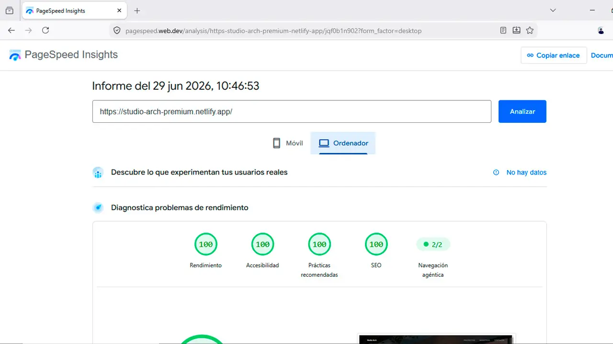
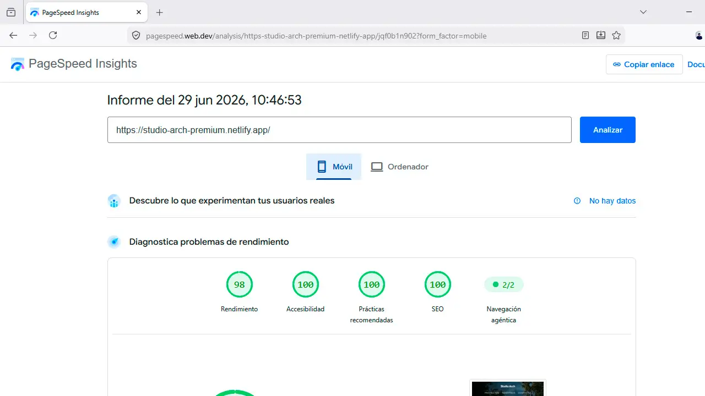

# Studio Arch Premium

Proyecto Frontend para un estudio de arquitectura contemporánea, desarrollado con Astro y enfocado en ofrecer una experiencia visual inmersiva sin comprometer el rendimiento.

Studio Arch Premium fue desarrollado utilizando **Astro** con generación estática (SSG), siguiendo una arquitectura basada en componentes y un enfoque **Mobile First** para maximizar el rendimiento, la accesibilidad y el SEO.

El proyecto integra animaciones avanzadas con **GSAP** y **Lenis**, optimización de imágenes, carga diferida de recursos y buenas prácticas de desarrollo para construir una interfaz moderna, escalable y preparada para producción.

## Objetivos del Proyecto

- Desarrollar una experiencia visual moderna e inmersiva.
- Mantener un rendimiento sobresaliente en Desktop y Mobile.
- Aplicar una arquitectura Frontend limpia, reutilizable y fácil de mantener.
- Optimizar Core Web Vitals y SEO sin sacrificar la experiencia de usuario.

---

## Enlaces del Proyecto

| Recurso                                                                                                                     | Enlace                                                                                                                               |
| :-------------------------------------------------------------------------------------------------------------------------- | :----------------------------------------------------------------------------------------------------------------------------------- |
|  | <a href="https://studio-arch-premium.netlify.app/" target="_blank" rel="noopener noreferrer">studio-arch-premium.netlify.app</a>     |
|      | <a href="https://github.com/alexanderramosweb/studio-arch-premium" target="_blank" rel="noopener noreferrer">studio-arch-premium</a> |
|     | Desplegado en Netlify (auto-deploy en cada push)                                                                                     |

## Vista General


---

### Secciones Destacadas

| Sección Hero                                                               | Galería de Proyectos                                                          |
| -------------------------------------------------------------------------- | ----------------------------------------------------------------------------- |
|  |  |

| Sección Nosotros                                                           | Sección Contacto                                                               |
| -------------------------------------------------------------------------- | ------------------------------------------------------------------------------ |
|  |  |

---

## Animaciones

<p align="center">
  <video src="https://github.com/user-attachments/assets/d4e76c9a-f7f1-4d17-9182-37b6ef241bc0" autoplay loop muted width="80%"></video>
</p>

Las animaciones fueron desarrolladas con **GSAP** y **Lenis**, priorizando una navegación fluida sin afectar el rendimiento ni las métricas de Core Web Vitals.

---

## Características

- Arquitectura basada en componentes con Astro.
- Desarrollo siguiendo un enfoque Mobile First.
- Generación estática (SSG).
- Optimización para Core Web Vitals.
- Optimización de imágenes en formato WebP.
- Lazy Loading de recursos.
- HTML semántico.
- Metadatos Open Graph.
- Twitter Cards.
- Canonical URL.

---

## Stack Tecnológico

### Design

<p>
  
  
</p>

### Frontend

<p>
  
  
  
</p>

<p>
  
  
  
</p>

### Animación

<p>
  
  
</p>

### Deploy

<p>
  
  
   
</p>

---

## Rendimiento

El proyecto fue optimizado siguiendo las recomendaciones de Lighthouse y Core Web Vitals para garantizar tiempos de carga rápidos, estabilidad visual y una experiencia fluida tanto en Desktop como en dispositivos móviles.

### Lighthouse

| Categoría      | Desktop | Mobile  |
| :------------- | :-----: | :-----: |
| Performance    | **98**  | **94**  |
| Accessibility  | **100** | **100** |
| Best Practices | **100** | **100** |
| SEO            | **100** | **100** |

### Core Web Vitals

| Métrica | Resultado    |
| :------ | :----------- |
| LCP     | **< 1.5 s**  |
| FCP     | **< 0.8 s**  |
| CLS     | **< 0.05**   |
| TBT     | **< 200 ms** |

## Rendimiento

<div align="center">
  
  
</div>

---

## Estructura del Proyecto

```text
studio-arch-premium
│
├── public/
│   └── readme-media/
│
├── src/
│   ├── animations/
│   ├── assets/
│   ├── components/
│   ├── data/
│   ├── layouts/
│   ├── pages/
│   ├── scripts/
│   ├── sections/
│   └── styles/
│
├── astro.config.mjs
├── package.json
├── tsconfig.json
└── tailwind.config.mjs
```

La estructura sigue una arquitectura modular basada en componentes, separando responsabilidades entre animaciones, secciones, estilos, datos y lógica de la aplicación para facilitar el mantenimiento y la escalabilidad del proyecto.

---

## Decisiones de Arquitectura

### Astro como Framework Principal

El proyecto fue desarrollado con **Astro** utilizando generación estática (SSG), ya que el contenido no requiere renderizado dinámico.

Esta decisión permitió:

- Reducir el JavaScript enviado al cliente.
- Mejorar los tiempos de carga inicial.
- Optimizar Core Web Vitals.
- Mantener una arquitectura simple y escalable.

---

### GSAP como Motor de Animaciones

Las animaciones fueron implementadas con **GSAP** debido a su precisión sobre el control del timeline y su integración independiente del framework.

Se utilizó **ScrollTrigger** para sincronizar las animaciones con el desplazamiento de la página sin depender de React u otras librerías de hidratación.

---

### Lenis para la Navegación

Se integró **Lenis** para proporcionar un desplazamiento más fluido y consistente entre navegadores.

Su integración con GSAP permitió sincronizar el scroll y las animaciones manteniendo una experiencia estable y un rendimiento elevado.

---

### Optimización de Recursos

El proyecto fue optimizado mediante diferentes estrategias:

- Imágenes convertidas a WebP.
- Lazy Loading.
- Generación estática.
- Componentización.
- Carga diferida de scripts.
- Optimización para Core Web Vitals.

---

## Instalación

### Requisitos

- Node.js 18 o superior
- npm

### Clonar el proyecto

```bash
git clone https://github.com/alexanderramosweb/studio-arch-premium.git

cd studio-arch-premium
```

### Instalar dependencias

```bash
npm install
```

### Iniciar el servidor de desarrollo

```bash
npm run dev
```

La aplicación estará disponible en:

```text
http://localhost:4321
```

### Build de Producción

```bash
npm run build

npm run preview
```

El proyecto genera una versión optimizada dentro del directorio `dist/`, lista para desplegarse en cualquier servicio de hosting estático.

---

## Implementaciones Destacadas

El proyecto incorpora distintas soluciones orientadas a mejorar la experiencia de usuario sin comprometer el rendimiento.

| Implementación                | Descripción                                                                 |
| :---------------------------- | :-------------------------------------------------------------------------- |
| Animaciones basadas en scroll | Sincronizadas mediante GSAP y ScrollTrigger.                                |
| Smooth Scroll                 | Navegación fluida utilizando Lenis.                                         |
| Lazy Loading                  | Carga diferida de imágenes y recursos no críticos.                          |
| Responsive Design             | Adaptación para Desktop, Tablet y Mobile siguiendo un enfoque Mobile First. |
| Optimización de recursos      | Imágenes en formato WebP y reducción del JavaScript enviado al cliente.     |
| SEO Técnico                   | HTML semántico, metadatos y estructura preparada para indexación.           |

---

## Retos Técnicos

### Optimizar el rendimiento sin sacrificar la experiencia visual

Se implementó una estrategia basada en generación estática (SSG), carga diferida de recursos y optimización de imágenes para mantener una interfaz altamente interactiva con excelentes métricas de Lighthouse.

---

### Sincronizar animaciones y desplazamiento

La integración entre GSAP, ScrollTrigger y Lenis permitió mantener una sincronización precisa entre el scroll y las animaciones, evitando inconsistencias visuales durante la navegación.

---

### Reducir el peso de los recursos

Todas las imágenes fueron optimizadas en formato WebP y cargadas bajo demanda mediante Lazy Loading para disminuir el tiempo de carga inicial.

---

## Información de Contacto

Si deseas conocer más sobre este proyecto o conversar sobre oportunidades profesionales y colaboraciones, puedes contactarme a través de los siguientes canales.

| Medio    | Enlace                                                                                                                       |
| :------- | :--------------------------------------------------------------------------------------------------------------------------- |
| Email    | <a href="mailto:alexander.digitaldev@gmail.com" target="_blank" rel="noopener noreferrer">alexander.digitaldev@gmail.com</a> |
| WhatsApp | <a href="https://wa.me/573127087551" target="_blank" rel="noopener noreferrer">+57 312 708 7551</a>                          |
| LinkedIn | <a href="https://linkedin.com/in/TUPERFIL" target="_blank" rel="noopener noreferrer">linkedin.com/in/TUPERFIL</a>            |
| Behance  | <a href="https://behance.net/TUPERFIL" target="_blank" rel="noopener noreferrer">behance.net/TUPERFIL</a>                    |
